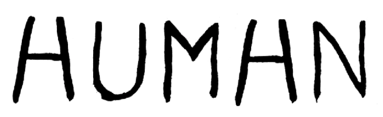

```{r setup, include=FALSE}
knitr::opts_chunk$set(echo = FALSE)
```

## Why are Artificial Neural Networks so powerful?

- ANNs capture context dependence!
    - I.e. the “meaning” of each variable depends not only on its observed value, but also on the context in which it was observed

```{r, out.width = "600px", fig.align="center"}

```

- They are universal Approximators
    - Using an ANN we can approximate function
    - We can illustrate the meaning of this with a small exercise using [TensorFlow Playground](https://playground.tensorflow.org)
